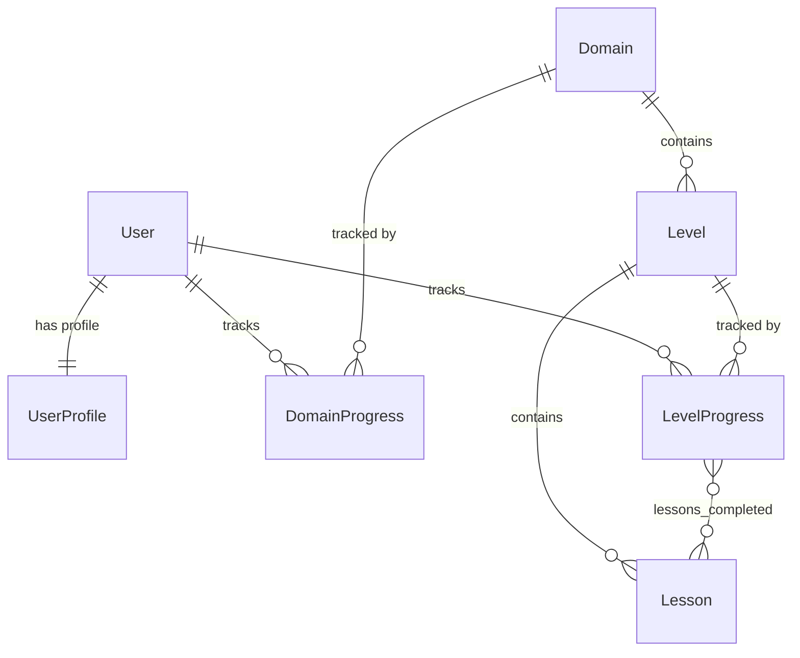

# FLYBETA — Development Walkthrough

A phase-by-phase record of everything built, decisions made, and how to verify each stage.

---

## Phase 1: Django DRF Models, Auth & SQLite ✅

**Goal:** Initialize the Django REST Framework backend with the 3-app architecture, all models, and a working SQLite database.

### What Was Built

#### 1. Project Scaffold
- Created Django project `flybeta` inside `/backend` via `django-admin startproject`
- Created virtual environment (`venv/`) and installed dependencies
- Dependencies: `django 5.2`, `djangorestframework 3.18`, `django-cors-headers 4.9`

#### 2. Three Django Apps

| App | Role |
|-----|------|
| `accounts` | Extended User via `UserProfile` (gamification state) |
| `learn` | Content models (Domain → Level → Lesson) + progress tracking |
| `api` | Centralized DRF endpoints (stubs for now, fleshed out in Phase 2) |

#### 3. Models Created

**`accounts.UserProfile`**
| Field | Type | Notes |
|-------|------|-------|
| `user` | OneToOneField → User | Auto-created via `post_save` signal |
| `xp` | IntegerField | Default: 0 |
| `coins` | IntegerField | Default: 0 |
| `streak` | IntegerField | Default: 0 |
| `last_active_date` | DateField | Nullable |

**`learn.Domain`**
| Field | Type | Notes |
|-------|------|-------|
| `name` | SlugField | Unique, URL-safe (e.g. `data-science`) |
| `title` | CharField | Display name (e.g. `Data Science`) |
| `icon` | CharField | Material Symbol name or emoji |
| `color` | CharField | Track accent hex (e.g. `#059669`) |

**`learn.Level`**
| Field | Type | Notes |
|-------|------|-------|
| `domain` | ForeignKey → Domain | Cascade delete |
| `number` | PositiveSmallIntegerField | 1–10 |
| `title` | CharField | Level title |
| `description` | TextField | Level description |
| | | `unique_together: (domain, number)` |

**`learn.Lesson`**
| Field | Type | Notes |
|-------|------|-------|
| `level` | ForeignKey → Level | Cascade delete |
| `order` | PositiveSmallIntegerField | Display order within level |
| `title` | CharField | Lesson title |
| `content_md` | TextField | Markdown body |
| `xp_reward` | PositiveIntegerField | Default: 10 |
| `coins_reward` | PositiveIntegerField | Default: 5 |
| `is_mandatory` | BooleanField | Default: True |
| | | `unique_together: (level, order)` |

**`learn.DomainProgress`**
| Field | Type | Notes |
|-------|------|-------|
| `user` | ForeignKey → User | |
| `domain` | ForeignKey → Domain | |
| `is_unlocked` | BooleanField | Default: True (all tracks unlocked from day one) |
| `current_level` | PositiveSmallIntegerField | Default: 1 |
| | | `unique_together: (user, domain)` |

**`learn.LevelProgress`**
| Field | Type | Notes |
|-------|------|-------|
| `user` | ForeignKey → User | |
| `level` | ForeignKey → Level | |
| `is_completed` | BooleanField | Default: False |
| `lessons_completed` | ManyToManyField → Lesson | Blank allowed |
| | | `unique_together: (user, level)` |

#### 4. Model Relationships



#### 5. Key Wiring & Configuration

- **Settings:** Registered all 3 apps + `rest_framework` + `corsheaders` in `INSTALLED_APPS`
- **CORS:** `CorsMiddleware` added before `CommonMiddleware`; `CORS_ALLOW_ALL_ORIGINS = True` for dev
- **DRF:** PageNumberPagination (20), Session + Basic auth, `IsAuthenticatedOrReadOnly`
- **URLs:** Admin at `/admin/`, API router at `/api/v1/`, DRF browsable auth at `/api-auth/`
- **Signals:** `accounts/signals.py` — `post_save` on User auto-creates `UserProfile`; wired via `AccountsConfig.ready()`
- **Admin:** `UserProfile` as inline on User admin; all 5 learn models registered with `list_display`, `list_filter`, `search_fields`, and `LessonInline` on Level

#### 6. Files Inventory

```
backend/
├── manage.py
├── requirements.txt
├── flybeta/
│   ├── __init__.py
│   ├── settings.py          # Apps, DRF, CORS, SQLite configured
│   ├── urls.py              # admin + /api/v1/ + /api-auth/
│   ├── wsgi.py
│   └── asgi.py
├── accounts/
│   ├── models.py            # UserProfile
│   ├── signals.py           # Auto-create profile on User creation
│   ├── apps.py              # ready() imports signals
│   ├── admin.py             # UserProfile inline on User admin
│   └── migrations/
│       └── 0001_initial.py
├── learn/
│   ├── models.py            # Domain, Level, Lesson, DomainProgress, LevelProgress
│   ├── admin.py             # All 5 models registered
│   └── migrations/
│       └── 0001_initial.py
├── api/
│   ├── urls.py              # Empty DRF router
│   ├── serializers.py       # Stub (TODO Phase 2)
│   └── views.py             # Stub (TODO Phase 2)
└── content/
    └── .gitkeep             # JSON curriculum directory (empty)
```

#### 7. Verification

| Check | Command | Result |
|-------|---------|--------|
| System check | `python manage.py check` | 0 issues |
| Generate migrations | `python manage.py makemigrations` | 2 files (accounts, learn) |
| Apply migrations | `python manage.py migrate` | All 19 applied |
| Confirm state | `python manage.py showmigrations` | All `[X]` |

#### 8. Design Decisions

- **No custom User model** — `UserProfile` via OneToOne keeps it simple and avoids auth complexity. SPEC.md doesn't require custom auth fields on the User itself.
- **`is_unlocked` defaults to True** — per SPEC: "all tracks unlocked from day one."
- **`lessons_completed` as M2M** — cleaner than a JSON array; lets us query completion state with Django ORM.
- **`content/` directory** — curriculum will be JSON files loaded via a management command (`load_level_content`), not hardcoded in Python.

#### 9. Content Pipeline (Curriculum Automation)

**Management Command:** `python manage.py load_level_content`

Located at `learn/management/commands/load_level_content.py`. Walks the `content/{domain}/level_{NN}.json` directory tree and upserts `Domain`, `Level`, and `Lesson` records via `update_or_create`.

**Features:**
- `--domain <name>` — only load a specific domain folder
- `--dry-run` — parse and validate JSON without writing to DB
- Idempotent — safe to re-run; second run updates existing records, never duplicates

**JSON Schema (per file):**
```json
{
  "domain": {
    "name": "cloud",
    "title": "Cloud Computing",
    "icon": "cloud",
    "color": "#2563EB"
  },
  "level": {
    "number": 1,
    "title": "Cloud Foundations",
    "description": "Intro to cloud computing concepts."
  },
  "lessons": [
    {
      "order": 1,
      "title": "What is Cloud Computing?",
      "content_md": "# Markdown content...",
      "xp_reward": 10,
      "coins_reward": 5,
      "is_mandatory": true
    }
  ]
}
```

**Sample Data Created:** `content/cloud/level_01.json` — Cloud Level 1 with 5 lessons (4 mandatory, 1 bonus):
1. What is Cloud Computing? (10 XP)
2. Cloud Service Models: IaaS, PaaS, SaaS (15 XP)
3. Public vs Private vs Hybrid Cloud (15 XP)
4. Meet the Big Three: AWS, GCP, Azure (10 XP)
5. Hands-On: Your First Cloud Resource (20 XP, optional)

**Verification:** Command run twice — first run created 1 domain + 1 level + 5 lessons; second run updated all with zero duplicates.

---

## Phase 2: React Vite Setup, Global UI Shell, Track/Lesson Components 🟡

### Phase 2a: DRF Read-Only API ✅

Built the API layer in the `api` app to serve curriculum data to the frontend.

#### 1. Serializers ([serializers.py](file:///Users/ayush/Desktop/code/flybeta-project/backend/api/serializers.py))

| Serializer | Nesting | Fields |
|------------|---------|--------|
| `LessonSerializer` | — | id, level, order, title, content_md, xp_reward, coins_reward, is_mandatory |
| `LevelSerializer` | Embeds `lessons` | id, domain, number, title, description, lessons[] |
| `DomainSerializer` | Embeds `levels` → `lessons` | id, name, title, icon, color, levels[] |

Nested serializers give the frontend full curriculum trees in a single request.

#### 2. ViewSets ([views.py](file:///Users/ayush/Desktop/code/flybeta-project/backend/api/views.py))

All use `ReadOnlyModelViewSet` — list + retrieve only, no write operations.

| ViewSet | Queryset Optimization | Extras |
|---------|----------------------|--------|
| `DomainViewSet` | `prefetch_related('levels__lessons')` | `lookup_field='name'` — slug-based lookup (`/domains/cloud/`) |
| `LevelViewSet` | `select_related('domain') + prefetch_related('lessons')` | `?domain=cloud` query filter |
| `LessonViewSet` | `select_related('level__domain')` | `?level=<id>` query filter |

#### 3. API Endpoints ([urls.py](file:///Users/ayush/Desktop/code/flybeta-project/backend/api/urls.py))

| Endpoint | Method | Description |
|----------|--------|-------------|
| `/api/v1/domains/` | GET | List all domains with nested levels/lessons |
| `/api/v1/domains/{name}/` | GET | Single domain by slug (e.g. `/api/v1/domains/cloud/`) |
| `/api/v1/levels/` | GET | List all levels (filter: `?domain=cloud`) |
| `/api/v1/levels/{id}/` | GET | Single level with nested lessons |
| `/api/v1/lessons/` | GET | List all lessons (filter: `?level=1`) |
| `/api/v1/lessons/{id}/` | GET | Single lesson with full markdown content |

#### 4. Verification

| Check | Result |
|-------|--------|
| `python manage.py check` | ✅ 0 issues |
| URL route introspection | ✅ All 12 routes registered (list + detail × 3 resources × 2 formats) |

### Phase 2b: React Vite Frontend ✅

Initialized React + Vite + Tailwind v4 frontend and converted Stitch prototypes into working React components wired to the DRF API.

#### 1. Project Setup

- Moved Stitch prototypes to `/design/stitch-reference/` (preserved as reference)
- Initialized Vite + React project in `/frontend` via `npx create-vite@latest`
- Installed: `react-router-dom`, `react-markdown`, `axios`, `tailwindcss@v4`, `@tailwindcss/vite`
- Vite proxy configured: `/api` → `http://localhost:8000` (avoids CORS in dev)

#### 2. Design System ([index.css](file:///Users/ayush/Desktop/code/flybeta-project/frontend/src/index.css))

Tailwind v4 CSS-first config using `@theme` directive. All DESIGN.md tokens mapped:

| Token | Value | Usage |
|-------|-------|-------|
| `--color-ink` | `#111111` | Base text, borders |
| `--color-canvas` | `#F9F8F6` | Page background |
| `--color-primary` | `#E52E2E` | CTAs, primary actions |
| `--color-emerald` | `#059669` | Data Science track |
| `--color-violet` | `#6D28D9` | AI & ML track |
| `--color-cobalt` | `#2563EB` | Cloud Computing track |
| `--color-gold` | `#EAB308` | Coins/badges |
| `--color-flame` | `#EA580C` | Streaks |

Global classes: `.brutalist-card`, `.brutalist-btn`, `.brutalist-badge`, `.heading-xl/lg/md`, `.label-mono`, `.grid-bg`, `.markdown-content`

#### 3. Components

| Component | File | Purpose |
|-----------|------|---------|
| `Navbar` | [Navbar.jsx](file:///Users/ayush/Desktop/code/flybeta-project/frontend/src/components/layout/Navbar.jsx) | Fixed top bar with logo, nav links, gamification badges |
| `Layout` | [Layout.jsx](file:///Users/ayush/Desktop/code/flybeta-project/frontend/src/components/layout/Layout.jsx) | Wraps pages with Navbar + grid background |
| `TrackCard` | [TrackCard.jsx](file:///Users/ayush/Desktop/code/flybeta-project/frontend/src/components/TrackCard.jsx) | Domain card with accent colors, level preview, CTA |
| `LevelNode` | [LevelNode.jsx](file:///Users/ayush/Desktop/code/flybeta-project/frontend/src/components/LevelNode.jsx) | Roadmap level with lesson list, mandatory/bonus counts |
| `MarkdownRenderer` | [MarkdownRenderer.jsx](file:///Users/ayush/Desktop/code/flybeta-project/frontend/src/components/MarkdownRenderer.jsx) | react-markdown wrapper with brutalist styling |

#### 4. Pages & Routing ([App.jsx](file:///Users/ayush/Desktop/code/flybeta-project/frontend/src/App.jsx))

| Route | Page | Data Source |
|-------|------|-------------|
| `/` | [TrackSelectionPage](file:///Users/ayush/Desktop/code/flybeta-project/frontend/src/pages/TrackSelectionPage.jsx) | `GET /api/v1/domains/` |
| `/track/:name` | [TrackRoadmapPage](file:///Users/ayush/Desktop/code/flybeta-project/frontend/src/pages/TrackRoadmapPage.jsx) | `GET /api/v1/domains/{name}/` |
| `/track/:name/level/:num/lesson/:order` | [LessonRunnerPage](file:///Users/ayush/Desktop/code/flybeta-project/frontend/src/pages/LessonRunnerPage.jsx) | `GET /api/v1/domains/{name}/` |

#### 5. API Service ([api.js](file:///Users/ayush/Desktop/code/flybeta-project/frontend/src/services/api.js))

Axios instance with functions: `getDomains()`, `getDomain(name)`, `getLevels(domain)`, `getLevel(id)`, `getLessons(level)`, `getLesson(id)`

#### 6. Files Inventory

```
frontend/
├── index.html                    # SEO meta, Google Fonts preconnect
├── vite.config.js                # React + Tailwind v4 + API proxy
├── package.json
├── src/
│   ├── main.jsx                  # Entry point
│   ├── App.jsx                   # React Router setup (3 routes)
│   ├── index.css                 # Tailwind v4 @theme + design system
│   ├── services/
│   │   └── api.js                # Axios API client
│   ├── components/
│   │   ├── layout/
│   │   │   ├── Navbar.jsx
│   │   │   └── Layout.jsx
│   │   ├── TrackCard.jsx
│   │   ├── LevelNode.jsx
│   │   └── MarkdownRenderer.jsx
│   └── pages/
│       ├── TrackSelectionPage.jsx
│       ├── TrackRoadmapPage.jsx
│       └── LessonRunnerPage.jsx
└── dist/                         # Production build output
```

#### 7. Verification

| Check | Result |
|-------|--------|
| `npm run build` | ✅ 0 warnings, 177ms, 243 modules |
| Bundle size | CSS: 17.2 kB (4.4 gzip), JS: 408.7 kB (130 gzip) |

---

## Phase 3: Gamification Logic & Theme Switcher ✅

### Subtask 3a: Mock Auth & Dev User ✅

Created management command to seed a development user for API testing.

- [create_dev_user.py](file:///Users/ayush/Desktop/code/flybeta-project/backend/accounts/management/commands/create_dev_user.py) — creates superuser `dev` / `flybeta123` with UserProfile
- Idempotent — safe to re-run

### Subtask 3b: `GET /api/v1/users/me/` ✅

| File | Change |
|------|--------|
| [serializers.py](file:///Users/ayush/Desktop/code/flybeta-project/backend/api/serializers.py) | Added `UserStatsSerializer` (username, xp, coins, streak, last_active_date) |
| [views.py](file:///Users/ayush/Desktop/code/flybeta-project/backend/api/views.py) | Added `UserMeView` with mock auth (returns dev user's profile) |
| [urls.py](file:///Users/ayush/Desktop/code/flybeta-project/backend/api/urls.py) | Wired at `users/me/` |

### Subtask 3c: Lesson Completion POST ✅

Added `@action(detail=True, methods=['post'])` named `complete` on `LessonViewSet`.

**Endpoint:** `POST /api/v1/lessons/{id}/complete/`

**Logic:**
1. Get-or-create `LevelProgress` for user + lesson's level
2. Add lesson to `lessons_completed` M2M (idempotent — no double-rewards)
3. Award `xp_reward` and `coins_reward` to UserProfile
4. Streak: yesterday → increment; today → no change; else → reset to 1
5. Check if all mandatory lessons done → set `is_completed = True`
6. Return updated stats + level completion status

**Verification:**

| Test | Result |
|------|--------|
| First completion | ✅ XP: 0→10, Coins: 0→5, Streak: 0→1 |
| Idempotent re-complete | ✅ `"already_completed"`, no double-reward |
| Second lesson | ✅ XP: 10→25, Coins: 5→10 |
| Same-day streak | ✅ Stays at 1 |

### Subtask 3d: Frontend Gamification ✅

| File | Change |
|------|--------|
| [UserContext.jsx](file:///Users/ayush/Desktop/code/flybeta-project/frontend/src/context/UserContext.jsx) | **New** — fetches `/users/me/` on load, exposes `updateUser` for instant updates |
| [api.js](file:///Users/ayush/Desktop/code/flybeta-project/frontend/src/services/api.js) | Added `getUserStats()` and `completeLesson(id)` |
| [Navbar.jsx](file:///Users/ayush/Desktop/code/flybeta-project/frontend/src/components/layout/Navbar.jsx) | Badges show live XP/coins/streak from UserContext |
| [LessonRunnerPage.jsx](file:///Users/ayush/Desktop/code/flybeta-project/frontend/src/pages/LessonRunnerPage.jsx) | "Complete & Continue" calls POST, updates context, shows +XP/+Coins flash |
| [App.jsx](file:///Users/ayush/Desktop/code/flybeta-project/frontend/src/App.jsx) | Wrapped with `UserProvider` |

### Subtask 3e: Theme Switcher ✅

| File | Change |
|------|--------|
| [ThemeContext.jsx](file:///Users/ayush/Desktop/code/flybeta-project/frontend/src/context/ThemeContext.jsx) | **New** — CSS variable swapping, localStorage persistence |
| [Navbar.jsx](file:///Users/ayush/Desktop/code/flybeta-project/frontend/src/components/layout/Navbar.jsx) | Theme dropdown added next to gamification badges |
| [App.jsx](file:///Users/ayush/Desktop/code/flybeta-project/frontend/src/App.jsx) | Wrapped with `ThemeProvider` |

**Available Themes:**

| Theme | Primary | Canvas | Shadows |
|-------|---------|--------|---------|
| 🏗️ Neo-Brutalism | Crimson `#E52E2E` | Cream `#F9F8F6` | Black hard offset |
| 🤖 Doraemon Blue | Blue `#3182ce` | Light blue `#ebf8ff` | Blue hard offset |

### Phase 3 Verification

| Check | Result |
|-------|--------|
| `npm run build` | ✅ 0 warnings, 183ms, 245 modules |
| `curl /api/v1/users/me/` | ✅ Returns dev user stats |
| `curl -X POST /api/v1/lessons/1/complete/` | ✅ Awards XP/coins, updates streak |

---

## Phase 4: AI Features ✅

### Subtask 4a: Project Architect (Blueprint Lab) ✅

**Goal:** Create a "Blueprint Lab" where users can enter a project idea and receive a step-by-step structural plan.

| Component | Changes |
|-----------|---------|
| Backend API | Added `BlueprintView` (`POST /api/v1/ai/architect/`) in `views.py`. Validates prompt. |
| AI Service | `generate_project_blueprint()` mock added to `ai_services.py` (returns 4 hardcoded steps). Ready for Gemini swap. |
| Frontend API | Added `generateBlueprint(prompt)` in `api.js`. |
| Frontend UI | Added `ProjectArchitectPage.jsx` at `/labs/architect`. Recreated stitch reference layout with input textarea, badges, and animated `blueprint-card` index cards. |

### Subtask 4b: Code Reviewer (Code Drishti) ✅

**Goal:** Create a "Code Drishti" page for static code analysis, identifying issues by severity.

| Component | Changes |
|-----------|---------|
| Backend API | Added `CodeReviewView` (`POST /api/v1/ai/reviewer/`) in `views.py`. Accepts `code` and `language`. |
| AI Service | `generate_code_review()` mock added to `ai_services.py` (returns 4 findings across CRITICAL, WARNING, INFO, STYLE). |
| Frontend API | Added `reviewCode(code, language)` in `api.js`. |
| Frontend UI | Added `CodeReviewerPage.jsx` at `/labs/reviewer`. Includes language dropdown, dark `code-textarea`, and `review-card` UI with severity-colored left borders and badges. |
| Routing & Nav | Wired routes in `App.jsx`, redirected `/labs` to `/labs/architect`. Fixed Navbar "Labs" highlight state for all `/labs/*` paths. Added `LabsSubNav` component to toggle between Blueprint Lab and Code Drishti. |

### Phase 4 Verification

| Check | Result |
|-------|--------|
| Backend | ✅ `python manage.py check` passes with 0 issues. |
| Frontend Build | ✅ `npm run build` succeeds (0 warnings, 248 modules). |
| E2E | ✅ Both AI endpoints respond with mock data on POST. |

---

*Last updated: 2026-08-22 — Phase 4 complete.*
