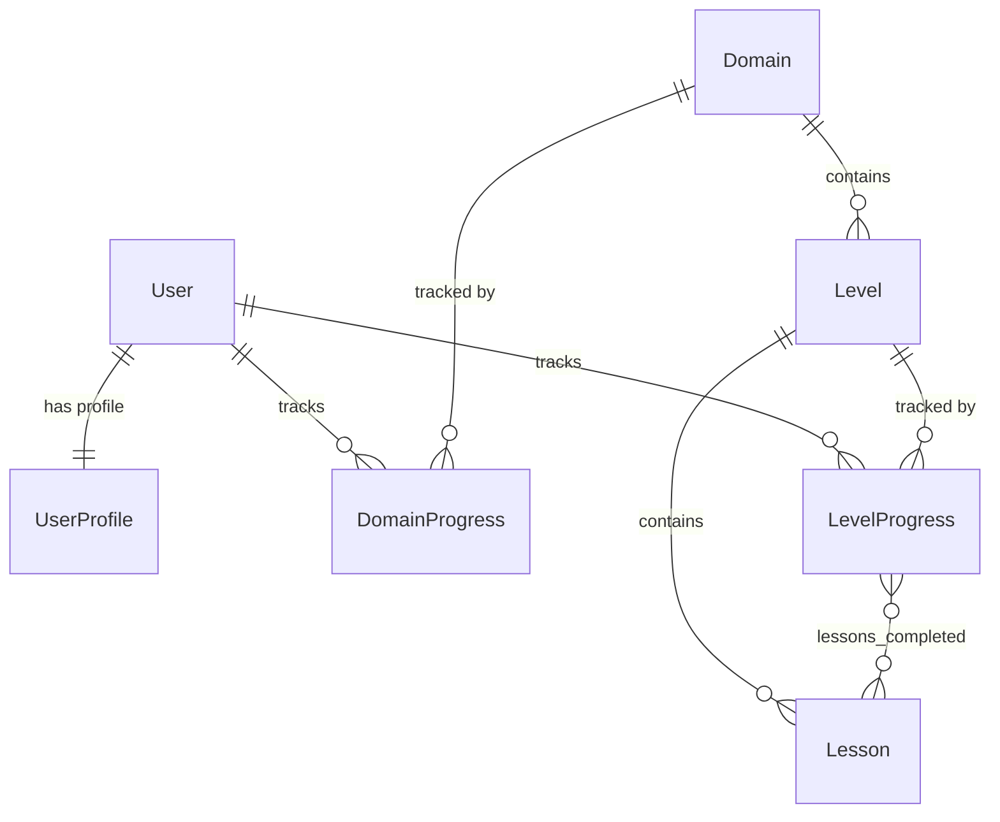

# FLYBETA — Development Walkthrough

A phase-by-phase record of everything built, decisions made, and how to verify each stage.

---

## Phase 1: Django DRF Models, Auth & SQLite ✅

**Goal:** Initialize the Django REST Framework backend with the 3-app architecture, all models, and a working SQLite database.

### What Was Built

#### 1. Project Scaffold
- Created Django project `flybeta` inside `/backend` via `django-admin startproject`
- Created virtual environment (`venv/`) and installed dependencies
- Dependencies: `django 5.2`, `djangorestframework 3.18`, `django-cors-headers 4.9`

#### 2. Three Django Apps

| App | Role |
|-----|------|
| `accounts` | Extended User via `UserProfile` (gamification state) |
| `learn` | Content models (Domain → Level → Lesson) + progress tracking |
| `api` | Centralized DRF endpoints (stubs for now, fleshed out in Phase 2) |

#### 3. Models Created

**`accounts.UserProfile`**
| Field | Type | Notes |
|-------|------|-------|
| `user` | OneToOneField → User | Auto-created via `post_save` signal |
| `xp` | IntegerField | Default: 0 |
| `coins` | IntegerField | Default: 0 |
| `streak` | IntegerField | Default: 0 |
| `last_active_date` | DateField | Nullable |

**`learn.Domain`**
| Field | Type | Notes |
|-------|------|-------|
| `name` | SlugField | Unique, URL-safe (e.g. `data-science`) |
| `title` | CharField | Display name (e.g. `Data Science`) |
| `icon` | CharField | Material Symbol name or emoji |
| `color` | CharField | Track accent hex (e.g. `#059669`) |

**`learn.Level`**
| Field | Type | Notes |
|-------|------|-------|
| `domain` | ForeignKey → Domain | Cascade delete |
| `number` | PositiveSmallIntegerField | 1–10 |
| `title` | CharField | Level title |
| `description` | TextField | Level description |
| | | `unique_together: (domain, number)` |

**`learn.Lesson`**
| Field | Type | Notes |
|-------|------|-------|
| `level` | ForeignKey → Level | Cascade delete |
| `order` | PositiveSmallIntegerField | Display order within level |
| `title` | CharField | Lesson title |
| `content_md` | TextField | Markdown body |
| `xp_reward` | PositiveIntegerField | Default: 10 |
| `coins_reward` | PositiveIntegerField | Default: 5 |
| `is_mandatory` | BooleanField | Default: True |
| | | `unique_together: (level, order)` |

**`learn.DomainProgress`**
| Field | Type | Notes |
|-------|------|-------|
| `user` | ForeignKey → User | |
| `domain` | ForeignKey → Domain | |
| `is_unlocked` | BooleanField | Default: True (all tracks unlocked from day one) |
| `current_level` | PositiveSmallIntegerField | Default: 1 |
| | | `unique_together: (user, domain)` |

**`learn.LevelProgress`**
| Field | Type | Notes |
|-------|------|-------|
| `user` | ForeignKey → User | |
| `level` | ForeignKey → Level | |
| `is_completed` | BooleanField | Default: False |
| `lessons_completed` | ManyToManyField → Lesson | Blank allowed |
| | | `unique_together: (user, level)` |

#### 4. Model Relationships



#### 5. Key Wiring & Configuration

- **Settings:** Registered all 3 apps + `rest_framework` + `corsheaders` in `INSTALLED_APPS`
- **CORS:** `CorsMiddleware` added before `CommonMiddleware`; `CORS_ALLOW_ALL_ORIGINS = True` for dev
- **DRF:** PageNumberPagination (20), Session + Basic auth, `IsAuthenticatedOrReadOnly`
- **URLs:** Admin at `/admin/`, API router at `/api/v1/`, DRF browsable auth at `/api-auth/`
- **Signals:** `accounts/signals.py` — `post_save` on User auto-creates `UserProfile`; wired via `AccountsConfig.ready()`
- **Admin:** `UserProfile` as inline on User admin; all 5 learn models registered with `list_display`, `list_filter`, `search_fields`, and `LessonInline` on Level

#### 6. Files Inventory

```
backend/
├── manage.py
├── requirements.txt
├── flybeta/
│   ├── __init__.py
│   ├── settings.py          # Apps, DRF, CORS, SQLite configured
│   ├── urls.py              # admin + /api/v1/ + /api-auth/
│   ├── wsgi.py
│   └── asgi.py
├── accounts/
│   ├── models.py            # UserProfile
│   ├── signals.py           # Auto-create profile on User creation
│   ├── apps.py              # ready() imports signals
│   ├── admin.py             # UserProfile inline on User admin
│   └── migrations/
│       └── 0001_initial.py
├── learn/
│   ├── models.py            # Domain, Level, Lesson, DomainProgress, LevelProgress
│   ├── admin.py             # All 5 models registered
│   └── migrations/
│       └── 0001_initial.py
├── api/
│   ├── urls.py              # Empty DRF router
│   ├── serializers.py       # Stub (TODO Phase 2)
│   └── views.py             # Stub (TODO Phase 2)
└── content/
    └── .gitkeep             # JSON curriculum directory (empty)
```

#### 7. Verification

| Check | Command | Result |
|-------|---------|--------|
| System check | `python manage.py check` | 0 issues |
| Generate migrations | `python manage.py makemigrations` | 2 files (accounts, learn) |
| Apply migrations | `python manage.py migrate` | All 19 applied |
| Confirm state | `python manage.py showmigrations` | All `[X]` |

#### 8. Design Decisions

- **No custom User model** — `UserProfile` via OneToOne keeps it simple and avoids auth complexity. SPEC.md doesn't require custom auth fields on the User itself.
- **`is_unlocked` defaults to True** — per SPEC: "all tracks unlocked from day one."
- **`lessons_completed` as M2M** — cleaner than a JSON array; lets us query completion state with Django ORM.
- **`content/` directory** — curriculum will be JSON files loaded via a management command (`load_level_content`), not hardcoded in Python.

#### 9. Content Pipeline (Curriculum Automation)

**Management Command:** `python manage.py load_level_content`

Located at `learn/management/commands/load_level_content.py`. Walks the `content/{domain}/level_{NN}.json` directory tree and upserts `Domain`, `Level`, and `Lesson` records via `update_or_create`.

**Features:**
- `--domain <name>` — only load a specific domain folder
- `--dry-run` — parse and validate JSON without writing to DB
- Idempotent — safe to re-run; second run updates existing records, never duplicates

**JSON Schema (per file):**
```json
{
  "domain": {
    "name": "cloud",
    "title": "Cloud Computing",
    "icon": "cloud",
    "color": "#2563EB"
  },
  "level": {
    "number": 1,
    "title": "Cloud Foundations",
    "description": "Intro to cloud computing concepts."
  },
  "lessons": [
    {
      "order": 1,
      "title": "What is Cloud Computing?",
      "content_md": "# Markdown content...",
      "xp_reward": 10,
      "coins_reward": 5,
      "is_mandatory": true
    }
  ]
}
```

**Sample Data Created:** `content/cloud/level_01.json` — Cloud Level 1 with 5 lessons (4 mandatory, 1 bonus):
1. What is Cloud Computing? (10 XP)
2. Cloud Service Models: IaaS, PaaS, SaaS (15 XP)
3. Public vs Private vs Hybrid Cloud (15 XP)
4. Meet the Big Three: AWS, GCP, Azure (10 XP)
5. Hands-On: Your First Cloud Resource (20 XP, optional)

**Verification:** Command run twice — first run created 1 domain + 1 level + 5 lessons; second run updated all with zero duplicates.

---

## Phase 2: React Vite Setup, Global UI Shell, Track/Lesson Components 🟡

### Phase 2a: DRF Read-Only API ✅

Built the API layer in the `api` app to serve curriculum data to the frontend.

#### 1. Serializers ([serializers.py](file:///Users/ayush/Desktop/code/flybeta-project/backend/api/serializers.py))

| Serializer | Nesting | Fields |
|------------|---------|--------|
| `LessonSerializer` | — | id, level, order, title, content_md, xp_reward, coins_reward, is_mandatory |
| `LevelSerializer` | Embeds `lessons` | id, domain, number, title, description, lessons[] |
| `DomainSerializer` | Embeds `levels` → `lessons` | id, name, title, icon, color, levels[] |

Nested serializers give the frontend full curriculum trees in a single request.

#### 2. ViewSets ([views.py](file:///Users/ayush/Desktop/code/flybeta-project/backend/api/views.py))

All use `ReadOnlyModelViewSet` — list + retrieve only, no write operations.

| ViewSet | Queryset Optimization | Extras |
|---------|----------------------|--------|
| `DomainViewSet` | `prefetch_related('levels__lessons')` | `lookup_field='name'` — slug-based lookup (`/domains/cloud/`) |
| `LevelViewSet` | `select_related('domain') + prefetch_related('lessons')` | `?domain=cloud` query filter |
| `LessonViewSet` | `select_related('level__domain')` | `?level=<id>` query filter |

#### 3. API Endpoints ([urls.py](file:///Users/ayush/Desktop/code/flybeta-project/backend/api/urls.py))

| Endpoint | Method | Description |
|----------|--------|-------------|
| `/api/v1/domains/` | GET | List all domains with nested levels/lessons |
| `/api/v1/domains/{name}/` | GET | Single domain by slug (e.g. `/api/v1/domains/cloud/`) |
| `/api/v1/levels/` | GET | List all levels (filter: `?domain=cloud`) |
| `/api/v1/levels/{id}/` | GET | Single level with nested lessons |
| `/api/v1/lessons/` | GET | List all lessons (filter: `?level=1`) |
| `/api/v1/lessons/{id}/` | GET | Single lesson with full markdown content |

#### 4. Verification

| Check | Result |
|-------|--------|
| `python manage.py check` | ✅ 0 issues |
| URL route introspection | ✅ All 12 routes registered (list + detail × 3 resources × 2 formats) |

### Phase 2b: React Vite Frontend ✅

Initialized React + Vite + Tailwind v4 frontend and converted Stitch prototypes into working React components wired to the DRF API.

#### 1. Project Setup

- Moved Stitch prototypes to `/design/stitch-reference/` (preserved as reference)
- Initialized Vite + React project in `/frontend` via `npx create-vite@latest`
- Installed: `react-router-dom`, `react-markdown`, `axios`, `tailwindcss@v4`, `@tailwindcss/vite`
- Vite proxy configured: `/api` → `http://localhost:8000` (avoids CORS in dev)

#### 2. Design System ([index.css](file:///Users/ayush/Desktop/code/flybeta-project/frontend/src/index.css))

Tailwind v4 CSS-first config using `@theme` directive. All DESIGN.md tokens mapped:

| Token | Value | Usage |
|-------|-------|-------|
| `--color-ink` | `#111111` | Base text, borders |
| `--color-canvas` | `#F9F8F6` | Page background |
| `--color-primary` | `#E52E2E` | CTAs, primary actions |
| `--color-emerald` | `#059669` | Data Science track |
| `--color-violet` | `#6D28D9` | AI & ML track |
| `--color-cobalt` | `#2563EB` | Cloud Computing track |
| `--color-gold` | `#EAB308` | Coins/badges |
| `--color-flame` | `#EA580C` | Streaks |

Global classes: `.brutalist-card`, `.brutalist-btn`, `.brutalist-badge`, `.heading-xl/lg/md`, `.label-mono`, `.grid-bg`, `.markdown-content`

#### 3. Components

| Component | File | Purpose |
|-----------|------|---------|
| `Navbar` | [Navbar.jsx](file:///Users/ayush/Desktop/code/flybeta-project/frontend/src/components/layout/Navbar.jsx) | Fixed top bar with logo, nav links, gamification badges |
| `Layout` | [Layout.jsx](file:///Users/ayush/Desktop/code/flybeta-project/frontend/src/components/layout/Layout.jsx) | Wraps pages with Navbar + grid background |
| `TrackCard` | [TrackCard.jsx](file:///Users/ayush/Desktop/code/flybeta-project/frontend/src/components/TrackCard.jsx) | Domain card with accent colors, level preview, CTA |
| `LevelNode` | [LevelNode.jsx](file:///Users/ayush/Desktop/code/flybeta-project/frontend/src/components/LevelNode.jsx) | Roadmap level with lesson list, mandatory/bonus counts |
| `MarkdownRenderer` | [MarkdownRenderer.jsx](file:///Users/ayush/Desktop/code/flybeta-project/frontend/src/components/MarkdownRenderer.jsx) | react-markdown wrapper with brutalist styling |

#### 4. Pages & Routing ([App.jsx](file:///Users/ayush/Desktop/code/flybeta-project/frontend/src/App.jsx))

| Route | Page | Data Source |
|-------|------|-------------|
| `/` | [TrackSelectionPage](file:///Users/ayush/Desktop/code/flybeta-project/frontend/src/pages/TrackSelectionPage.jsx) | `GET /api/v1/domains/` |
| `/track/:name` | [TrackRoadmapPage](file:///Users/ayush/Desktop/code/flybeta-project/frontend/src/pages/TrackRoadmapPage.jsx) | `GET /api/v1/domains/{name}/` |
| `/track/:name/level/:num/lesson/:order` | [LessonRunnerPage](file:///Users/ayush/Desktop/code/flybeta-project/frontend/src/pages/LessonRunnerPage.jsx) | `GET /api/v1/domains/{name}/` |

#### 5. API Service ([api.js](file:///Users/ayush/Desktop/code/flybeta-project/frontend/src/services/api.js))

Axios instance with functions: `getDomains()`, `getDomain(name)`, `getLevels(domain)`, `getLevel(id)`, `getLessons(level)`, `getLesson(id)`

#### 6. Files Inventory

```
frontend/
├── index.html                    # SEO meta, Google Fonts preconnect
├── vite.config.js                # React + Tailwind v4 + API proxy
├── package.json
├── src/
│   ├── main.jsx                  # Entry point
│   ├── App.jsx                   # React Router setup (3 routes)
│   ├── index.css                 # Tailwind v4 @theme + design system
│   ├── services/
│   │   └── api.js                # Axios API client
│   ├── components/
│   │   ├── layout/
│   │   │   ├── Navbar.jsx
│   │   │   └── Layout.jsx
│   │   ├── TrackCard.jsx
│   │   ├── LevelNode.jsx
│   │   └── MarkdownRenderer.jsx
│   └── pages/
│       ├── TrackSelectionPage.jsx
│       ├── TrackRoadmapPage.jsx
│       └── LessonRunnerPage.jsx
└── dist/                         # Production build output
```

#### 7. Verification

| Check | Result |
|-------|--------|
| `npm run build` | ✅ 0 warnings, 177ms, 243 modules |
| Bundle size | CSS: 17.2 kB (4.4 gzip), JS: 408.7 kB (130 gzip) |

---

## Phase 3: Gamification Logic & Theme Switcher ✅

### Subtask 3a: Mock Auth & Dev User ✅

Created management command to seed a development user for API testing.

- [create_dev_user.py](file:///Users/ayush/Desktop/code/flybeta-project/backend/accounts/management/commands/create_dev_user.py) — creates superuser `dev` / `flybeta123` with UserProfile
- Idempotent — safe to re-run

### Subtask 3b: `GET /api/v1/users/me/` ✅

| File | Change |
|------|--------|
| [serializers.py](file:///Users/ayush/Desktop/code/flybeta-project/backend/api/serializers.py) | Added `UserStatsSerializer` (username, xp, coins, streak, last_active_date) |
| [views.py](file:///Users/ayush/Desktop/code/flybeta-project/backend/api/views.py) | Added `UserMeView` with mock auth (returns dev user's profile) |
| [urls.py](file:///Users/ayush/Desktop/code/flybeta-project/backend/api/urls.py) | Wired at `users/me/` |

### Subtask 3c: Lesson Completion POST ✅

Added `@action(detail=True, methods=['post'])` named `complete` on `LessonViewSet`.

**Endpoint:** `POST /api/v1/lessons/{id}/complete/`

**Logic:**
1. Get-or-create `LevelProgress` for user + lesson's level
2. Add lesson to `lessons_completed` M2M (idempotent — no double-rewards)
3. Award `xp_reward` and `coins_reward` to UserProfile
4. Streak: yesterday → increment; today → no change; else → reset to 1
5. Check if all mandatory lessons done → set `is_completed = True`
6. Return updated stats + level completion status

**Verification:**

| Test | Result |
|------|--------|
| First completion | ✅ XP: 0→10, Coins: 0→5, Streak: 0→1 |
| Idempotent re-complete | ✅ `"already_completed"`, no double-reward |
| Second lesson | ✅ XP: 10→25, Coins: 5→10 |
| Same-day streak | ✅ Stays at 1 |

### Subtask 3d: Frontend Gamification ✅

| File | Change |
|------|--------|
| [UserContext.jsx](file:///Users/ayush/Desktop/code/flybeta-project/frontend/src/context/UserContext.jsx) | **New** — fetches `/users/me/` on load, exposes `updateUser` for instant updates |
| [api.js](file:///Users/ayush/Desktop/code/flybeta-project/frontend/src/services/api.js) | Added `getUserStats()` and `completeLesson(id)` |
| [Navbar.jsx](file:///Users/ayush/Desktop/code/flybeta-project/frontend/src/components/layout/Navbar.jsx) | Badges show live XP/coins/streak from UserContext |
| [LessonRunnerPage.jsx](file:///Users/ayush/Desktop/code/flybeta-project/frontend/src/pages/LessonRunnerPage.jsx) | "Complete & Continue" calls POST, updates context, shows +XP/+Coins flash |
| [App.jsx](file:///Users/ayush/Desktop/code/flybeta-project/frontend/src/App.jsx) | Wrapped with `UserProvider` |

### Subtask 3e: Theme Switcher ✅

| File | Change |
|------|--------|
| [ThemeContext.jsx](file:///Users/ayush/Desktop/code/flybeta-project/frontend/src/context/ThemeContext.jsx) | **New** — CSS variable swapping, localStorage persistence |
| [Navbar.jsx](file:///Users/ayush/Desktop/code/flybeta-project/frontend/src/components/layout/Navbar.jsx) | Theme dropdown added next to gamification badges |
| [App.jsx](file:///Users/ayush/Desktop/code/flybeta-project/frontend/src/App.jsx) | Wrapped with `ThemeProvider` |

**Available Themes:**

| Theme | Primary | Canvas | Shadows |
|-------|---------|--------|---------|
| 🏗️ Neo-Brutalism | Crimson `#E52E2E` | Cream `#F9F8F6` | Black hard offset |
| 🤖 Doraemon Blue | Blue `#3182ce` | Light blue `#ebf8ff` | Blue hard offset |

### Phase 3 Verification

| Check | Result |
|-------|--------|
| `npm run build` | ✅ 0 warnings, 183ms, 245 modules |
| `curl /api/v1/users/me/` | ✅ Returns dev user stats |
| `curl -X POST /api/v1/lessons/1/complete/` | ✅ Awards XP/coins, updates streak |

---

## Phase 4: AI Features ✅

### Subtask 4a: Project Architect (Blueprint Lab) ✅

**Goal:** Create a "Blueprint Lab" where users can enter a project idea and receive a step-by-step structural plan.

| Component | Changes |
|-----------|---------|
| Backend API | Added `BlueprintView` (`POST /api/v1/ai/architect/`) in `views.py`. Validates prompt. |
| AI Service | `generate_project_blueprint()` mock added to `ai_services.py` (returns 4 hardcoded steps). Ready for Gemini swap. |
| Frontend API | Added `generateBlueprint(prompt)` in `api.js`. |
| Frontend UI | Added `ProjectArchitectPage.jsx` at `/labs/architect`. Recreated stitch reference layout with input textarea, badges, and animated `blueprint-card` index cards. |

### Subtask 4b: Code Reviewer (Code Drishti) ✅

**Goal:** Create a "Code Drishti" page for static code analysis, identifying issues by severity.

| Component | Changes |
|-----------|---------|
| Backend API | Added `CodeReviewView` (`POST /api/v1/ai/reviewer/`) in `views.py`. Accepts `code` and `language`. |
| AI Service | `generate_code_review()` mock added to `ai_services.py` (returns 4 findings across CRITICAL, WARNING, INFO, STYLE). |
| Frontend API | Added `reviewCode(code, language)` in `api.js`. |
| Frontend UI | Added `CodeReviewerPage.jsx` at `/labs/reviewer`. Includes language dropdown, dark `code-textarea`, and `review-card` UI with severity-colored left borders and badges. |
| Routing & Nav | Wired routes in `App.jsx`, redirected `/labs` to `/labs/architect`. Fixed Navbar "Labs" highlight state for all `/labs/*` paths. Added `LabsSubNav` component to toggle between Blueprint Lab and Code Drishti. |

### Phase 4 Verification

| Check | Result |
|-------|--------|
| Backend | ✅ `python manage.py check` passes with 0 issues. |
| Frontend Build | ✅ `npm run build` succeeds (0 warnings, 248 modules). |
| E2E | ✅ Both AI endpoints respond with mock data on POST. |

---

## Phase 4c: Curriculum Expansion (Levels 1–7) ✅

**Goal:** Populate all three learning tracks with complete, professional-grade curriculum content spanning 7 levels each.

### Content Files Created

21 JSON files total, following the established schema (`domain`, `level`, `lessons[]`):

```
backend/content/
├── cloud/
│   ├── level_01.json   # Cloud Foundations (5 lessons)
│   ├── level_02.json   # Storage & Networking Fundamentals (4 lessons)
│   ├── level_03.json   # Compute & Virtual Machines (4 lessons)
│   ├── level_04.json   # Containers & Docker (4 lessons)
│   ├── level_05.json   # Kubernetes & Orchestration (4 lessons)
│   ├── level_06.json   # Serverless Architecture (4 lessons)
│   └── level_07.json   # Cloud Capstone (4 lessons)
├── ai/
│   ├── level_01.json   # AI Foundations (5 lessons)
│   ├── level_02.json   # Neural Networks & Deep Learning Anatomy (4 lessons)
│   ├── level_03.json   # CNNs & Computer Vision (4 lessons)
│   ├── level_04.json   # RNNs, LSTMs & Sequence Models (4 lessons)
│   ├── level_05.json   # Transformers & Attention (4 lessons)
│   ├── level_06.json   # Generative AI & Diffusion Models (4 lessons)
│   └── level_07.json   # AI Capstone (4 lessons)
└── data/
    ├── level_01.json   # Data Science Foundations (5 lessons)
    ├── level_02.json   # Data Wrangling & Feature Engineering (4 lessons)
    ├── level_03.json   # Supervised Learning (4 lessons)
    ├── level_04.json   # Unsupervised Learning & Clustering (4 lessons)
    ├── level_05.json   # Model Evaluation & Hyperparameter Tuning (4 lessons)
    ├── level_06.json   # Time Series & Advanced Regression (4 lessons)
    └── level_07.json   # Data Science Capstone (4 lessons)
```

### Content Quality

- Each lesson contains detailed `content_md` with Markdown headings, tables, code blocks, and comparisons
- XP rewards: 10–20 per lesson; Coin rewards: 5–10 per lesson
- Final lesson per level marked `is_mandatory: false` (bonus/hands-on)
- All content loaded into SQLite via `python manage.py load_level_content` (idempotent)

---

## Phase 4d: Multi-Theme System ✅

**Goal:** Expand the theme system from 2 themes to 5, with per-theme character images, background images, and a scalable architecture for adding future themes.

### Theme Architecture

The theme system was refactored for scalability:

| Config | File | Purpose |
|--------|------|---------|
| `THEMES` | [ThemeContext.jsx](file:///Users/ayush/Desktop/code/flybeta-project/frontend/src/context/ThemeContext.jsx) | CSS variable definitions per theme (colors, shadows, fonts) |
| `THEME_IMAGES` | [TrackCard.jsx](file:///Users/ayush/Desktop/code/flybeta-project/frontend/src/components/TrackCard.jsx) | Per-theme domain→character image mapping |
| `THEME_BACKGROUNDS` | [Layout.jsx](file:///Users/ayush/Desktop/code/flybeta-project/frontend/src/components/layout/Layout.jsx) | Per-theme background image paths |

Adding a new theme requires:
1. Add entry to `THEMES` in ThemeContext.jsx (CSS variables)
2. Add entry to `THEME_IMAGES` in TrackCard.jsx (character images)
3. Add entry to `THEME_BACKGROUNDS` in Layout.jsx (background image)
4. Place assets in `frontend/public/<theme-name>/`

### Themes Registered

| Theme | Key | Primary | Borders | Characters | Background |
|-------|-----|---------|---------|------------|------------|
| 🏗️ Neo-Brutalism | `neo-brutalism` | `#E52E2E` | `#111111` | Lucide icons (fallback) | Grid CSS pattern |
| 🤖 Doraemon Blue | `doraemon-blue` | `#3182ce` | `#2b6cb0` | Doraemon, Shizuka, Nobita | `doremon_flybeta.png` |
| 🖍️ Shinchan | `shinchan` | `#FDE047` | `#DC2626` | Shinchan, Bo-chan, Meni | `shinchan-theme-bg.png` |
| 👑 Princess | `princess` | `#A21CAF` | `#A21CAF` | Rapunzel, Mulan, Belle | `bg-theme.jpeg` |
| ⚔️ Anime | `anime` | `#F97316` | `#0F172A` | Zoro, Luffy, Nami | `anime-theme.jpeg` |

### Character Image Mapping (TrackCard.jsx)

| Theme | Cloud Track | AI Track | Data Track |
|-------|-------------|----------|------------|
| Doraemon | `doremon.png` | `sizuka.png` | `nobita.png` |
| Shinchan | `shinchan.png` | `bo chain.png` | `meni.png` |
| Princess | `rapunzel_new.png` | `Mulan.png` | `belle.png` |
| Anime | `zoro.png` | `luffy.png` | `nami.png` |
| Neo-Brutalism | Lucide `Cloud` icon | Lucide `Bot` icon | Lucide `BarChart3` icon |

### Asset Directories

```
frontend/public/
├── doremon-theme/
│   ├── doremon.png, sizuka.png, nobita.png   # Characters (bg-removed)
│   └── doremon_flybeta.png                    # Background
├── shinchan-theme/
│   ├── shinchan.png, bo chain.png, meni.png  # Characters
│   └── shinchan-theme-bg.png                  # Background
├── disney-princess-thene/
│   ├── rapunzel_new.png, Mulan.png, belle.png # Characters
│   └── bg-theme.jpeg                          # Background (compressed: 18MB → 388KB)
└── anime-theme/
    ├── zoro.png, luffy.png, nami.png          # Characters
    └── anime-theme.jpeg                        # Background
```

### Key Implementation Details

- **Background overlay:** All themed backgrounds get a fixed `#F9F8F6` cream overlay at 80% opacity for Neo-Brutalist text legibility
- **Z-stacking:** Overlay sits at `z-0`, all content at `z-10`
- **Character images:** Use `object-contain object-bottom p-2` to display fully without cropping
- **Badge positioning:** `absolute top-4 left-4 z-20` pins the track code badge above character images
- **Shinchan badge text:** Uses `var(--color-ink)` (dark) instead of `var(--color-canvas)` since yellow primary needs dark text for contrast
- **Image optimization:** Princess background was 18MB raw; compressed to 388KB via `sips` (resolved latency when navigating)

### Files Modified

| File | Changes |
|------|---------|
| [ThemeContext.jsx](file:///Users/ayush/Desktop/code/flybeta-project/frontend/src/context/ThemeContext.jsx) | Added 3 theme entries (Shinchan, Princess, Anime) with full CSS variable sets |
| [TrackCard.jsx](file:///Users/ayush/Desktop/code/flybeta-project/frontend/src/components/TrackCard.jsx) | Refactored to unified `THEME_IMAGES` map; conditional character rendering; badge positioning fix |
| [Layout.jsx](file:///Users/ayush/Desktop/code/flybeta-project/frontend/src/components/layout/Layout.jsx) | Refactored to `THEME_BACKGROUNDS` config map; conditional bg + overlay for all themes |
| [TrackRoadmapPage.jsx](file:///Users/ayush/Desktop/code/flybeta-project/frontend/src/pages/TrackRoadmapPage.jsx) | Switched hardcoded colors to CSS variables for theme compatibility |
| [LevelNode.jsx](file:///Users/ayush/Desktop/code/flybeta-project/frontend/src/components/LevelNode.jsx) | Removed `accentColor` prop; uses CSS variables |

### Documentation Created

| File | Purpose |
|------|---------|
| [theme-context.md](file:///Users/ayush/Desktop/code/flybeta-project/docs/theme-context.md) | Developer blueprint for adding future themes (asset naming, overlay strategy, step-by-step checklist) |

### Phase 4c/4d Verification

| Check | Result |
|-------|--------|
| `npm run build` | ✅ 0 warnings, 2035 modules, 333ms |
| Bundle size | CSS: 22.87 kB (5.49 gzip), JS: 434.96 kB (137.23 gzip) |
| Theme cycling | ✅ All 5 themes cycle correctly via navbar dropdown |
| Content loading | ✅ All 21 JSON files loaded via `load_level_content` |

---

## Phase 5: Vision Suite (In Progress) 🟡

**Goal:** Build the Vision Suite, an AI-powered video learning hub with curated channels and YouTube-to-Quiz extraction.

### Phase 5.1: Navigation & Global Scaffolding ✅

| Component | Changes |
|-----------|---------|
| `Navbar.jsx` | Added "Vision" tab to global navigation (`/vision`). |
| `OracleWidget.jsx` | Built a floating FAB + slide-out chat panel UI (`brutalist-badge`, typing indicators). Contains mock responses for "The Oracle" AI mentor. |
| `Layout.jsx` | Integrated `OracleWidget` globally so it persists across all pages. |

### Phase 5.2: The Vision Hub UI (Part 1) ✅

| Component | Changes |
|-----------|---------|
| `VisionPage.jsx` | Created the main Vision Hub page with a Hero Header and a Sub-Navigation toggle for "Channels" and "Synapse". Added placeholder components for now. |
| `App.jsx` | Added routing for `/vision` pointing to `VisionPage`. |

### Phase 5.3: ChannelFeed & VideoCard (Task 2.2) ✅

**Goal:** Build the video feed UI for the Channels tab — track-grouped VideoCards with thumbnails, duration badges, and navigation to a 60/40 video detail page.

#### 1. Mock Data Layer

| File | Purpose |
|------|---------|
| [mockVideos.js](file:///Users/ayush/Desktop/code/flybeta-project/frontend/src/data/mockVideos.js) | 12 curated YouTube videos (4 per track) with real video IDs and thumbnail URLs. Exports `TRACKS`, `getVideosByTrack()`, `getVideoById()`. |

#### 2. New Components

| Component | File | Purpose |
|-----------|------|---------|
| `VideoCard` | [VideoCard.jsx](file:///Users/ayush/Desktop/code/flybeta-project/frontend/src/components/vision/VideoCard.jsx) | Brutalist video card with thumbnail, play-overlay on hover, duration badge, track tag, title, and channel name. Wraps in `<Link>` to `/vision/video/:id`. |
| `ChannelFeed` | [ChannelFeed.jsx](file:///Users/ayush/Desktop/code/flybeta-project/frontend/src/components/vision/ChannelFeed.jsx) | Groups VideoCards by learning track with section headers (track-colored icon badges, video count). Responsive grid: 1→2→4 columns. |
| `VideoDetailPage` | [VideoDetailPage.jsx](file:///Users/ayush/Desktop/code/flybeta-project/frontend/src/pages/VideoDetailPage.jsx) | 60/40 split layout — embedded YouTube iframe (left) + Synapse Engine placeholder (right). Includes back navigation and video metadata. |

#### 3. Files Modified

| File | Changes |
|------|---------|
| [VisionPage.jsx](file:///Users/ayush/Desktop/code/flybeta-project/frontend/src/pages/VisionPage.jsx) | Replaced `ChannelFeedPlaceholder` with real `<ChannelFeed />` component. |
| [App.jsx](file:///Users/ayush/Desktop/code/flybeta-project/frontend/src/App.jsx) | Added `VideoDetailPage` import and route at `/vision/video/:id`. |

#### 4. VideoCard Features

- **Thumbnail:** `aspect-video` with `object-cover`, lazy loading, scale-up on hover
- **Play overlay:** Black 30% overlay with centered brutalist play button on hover
- **Duration badge:** Bottom-right `label-mono` with clock icon, dark background
- **Track tag:** Top-left accent-colored badge (cobalt/violet/emerald per track)
- **Card body:** Bold title (2-line clamp) + muted channel name
- **Interaction:** Full card is a `<Link>`, hover lifts card with shadow expansion

#### 5. VideoDetailPage Layout

```
┌──────────────────────────────┬───────────────────────┐
│                              │                       │
│    YouTube Embedded Player   │   Synapse Engine       │
│    (60%)                     │   Placeholder (40%)    │
│                              │   [Task 2.3]           │
│                              │                       │
├──────────────────────────────┘                       │
│  Title                       │  "AWAITING             │
│  Channel Name                │   INTEGRATION"         │
└──────────────────────────────┴───────────────────────┘
```

#### 6. Track Filter Bar (spec completion)

Added to `ChannelFeed.jsx`: row of clickable track badges (`All`, `AI`, `Cloud`, `Data Science`) with:
- Active state: accent-colored background, white text, lifted shadow
- Inactive state: white background, ink text, subtle shadow
- Count indicator on "All" badge
- Filter logic: clicking a badge shows only that track's section; "All" shows all

Grid changed from `lg:grid-cols-4` → `lg:grid-cols-3` per spec.

#### 7. Verification

| Check | Result |
|-------|--------|
| `npm run build` | ✅ 0 warnings, 2042 modules, 513ms |
| Bundle size | CSS: 28.50 kB (6.54 gzip), JS: 459.86 kB (143.77 gzip) |

### Phase 5.4: SynapseEngine (Task 2.3) ✅

**Goal:** Build the YouTube URL-to-Quiz extractor with multi-step loading states, embedded video player, and interactive mock quiz.

#### 1. New Component

| Component | File | Purpose |
|-----------|------|---------|
| `SynapseEngine` | [SynapseEngine.jsx](file:///Users/ayush/Desktop/code/flybeta-project/frontend/src/components/vision/SynapseEngine.jsx) | URL input → loading stepper → 60/40 results (player + quiz) |

#### 2. SynapseEngine Features

**URL Input Section:**
- Oversized input field (`border-4`, `text-lg`, full-width) with hard shadow
- Purple focus state (`border-color: violet`)
- "EXTRACT ⚡" button with press-down micro-interaction
- URL validation: extracts video ID from `youtube.com/watch`, `youtu.be`, and `youtube.com/embed` patterns
- Error state with red alert badge for invalid URLs

**Loading Stepper:**
- 3-step vertical progress indicator:
  1. "Extracting Transcript…"
  2. "Analyzing Content…"
  3. "Synthesizing Quiz…"
- Completed steps: green background + checkmark
- Active step: violet background + spinning loader
- Pending steps: numbered, muted
- Steps advance via `setTimeout` cascade (1200ms → 1500ms → 1000ms)

**Results (60/40 Split):**
- **Left (60%):** Embedded YouTube iframe with brutalist border + shadow
- **Right (40%):** Interactive quiz card with:
  - 3 multiple-choice questions with radio buttons
  - Instant feedback on answer: green (correct) / red (incorrect) with border color + background
  - Left accent border per question (violet → green/red on answer)
  - Score summary card after all questions answered
- "← NEW EXTRACTION" reset button to start over

#### 3. Files Modified

| File | Changes |
|------|---------|
| [VisionPage.jsx](file:///Users/ayush/Desktop/code/flybeta-project/frontend/src/pages/VisionPage.jsx) | Replaced `SynapseEnginePlaceholder` with real `<SynapseEngine />` |
| [index.css](file:///Users/ayush/Desktop/code/flybeta-project/frontend/src/index.css) | Added `@keyframes spin` for loading stepper animation |

#### 4. Verification

| Check | Result |
|-------|--------|
| `npm run build` | ✅ 0 warnings, 2042 modules, 513ms |
| Bundle size | CSS: 28.50 kB (6.54 gzip), JS: 459.86 kB (143.77 gzip) |

---

## Phase 6: Real AI API Integration ✅

**Goal:** Connect the mock AI placeholders to the live Gemini API using the `google-genai` SDK and robust Pydantic structured outputs.

### Subtask 6a: Synapse Engine Backend ✅

**Goal:** Generate dynamic quizzes from YouTube transcripts using Gemini 2.5 Flash.

| Component | Changes |
|-----------|---------|
| Backend AI Service | Created `generate_video_quiz(video_id)` in `ai_services.py` using `youtube-transcript-api` to fetch transcripts and `google-genai` to generate a 3-question quiz adhering to a strict Pydantic `QuizResponse` schema. |
| Backend API View | Created `SynapseExtractView` (`POST /api/v1/ai/synapse/`) to extract YouTube IDs via regex and return the JSON array of questions, with proper error handling for disabled transcripts. |
| Frontend API | Added `extractVideoKnowledge(videoUrl)` to `api.js`. |
| Frontend UI | Replaced `MOCK_QUIZ` in `SynapseEngine.jsx` with real `quizQuestions` state populated via the live API. Dynamic rendering of questions, options, and validation via `correct_index`. |

### Subtask 6b: The Oracle (AI Mentor) ✅

**Goal:** Connect the floating Oracle widget to act as a globally available, context-aware AI mentor for FlyBeta.

| Component | Changes |
|-----------|---------|
| Backend AI Service | Created `ask_oracle(message, history)` in `ai_services.py` with a highly specialized system prompt (Neo-Brutalist tone, technical accuracy). Uses Gemini 2.5 Flash and correctly maps conversational roles (`user` -> `user`, `ai` -> `model`) for `google-genai`. |
| Backend API View | Created `OracleChatView` (`POST /api/v1/ai/oracle/`) to validate history arrays and return `{ "reply": "..." }`, catching errors with a fallback 500 response ("The Oracle is meditating"). |
| Frontend API | Added `askOracle(message, history)` to `api.js`. |
| Frontend UI | Replaced mock logic in `OracleWidget.jsx` with real async state updates, `isTyping` indicators, and automated scroll-to-bottom handling. The Oracle now holds conversational memory across interactions! |

### Subtask 6c: AI Mentor Proxies (Blueprint Lab & Code Drishti) ✅

**Goal:** Upgrade the existing project architecture and code review labs from mock data to live Gemini AI execution, while strictly maintaining the original Pydantic schemas.

| Component | Changes |
|-----------|---------|
| Backend AI Service | Updated `generate_project_blueprint()` and `generate_code_review()` to remove mock fallback responses. Updated system instructions to an "elite software architect" and a "strict, senior code reviewer." Enforced structured outputs using the original Pydantic schemas (`BlueprintResponse` and `ReviewResponse`). |
| Backend API View | Updated `BlueprintView` and `CodeReviewView` to wrap the AI service calls in `try...except` blocks, catching API errors gracefully and returning a `500 INTERNAL SERVER ERROR` with user-friendly fallback messages ("The Architect/Reviewer is meditating"). |
| Frontend | Remains completely unchanged! By strictly honoring the previous mock JSON structures (`step_number`, `tag`, `tasks`, `estimate`, etc.), the live AI responses instantly plugged into the React components with zero front-end breakage. |

### Phase 6 Verification

| Check | Result |
|-------|--------|
| Synapse extraction | ✅ Successfully generated JSON quiz from Karpathy's "Let's build GPT" |
| Oracle context | ✅ Successfully maintained memory across multi-turn conversation |
| Architect Live | ✅ Blueprint generation yields valid steps that render perfectly |
| Code Review Live | ✅ Code analysis returns structured severity findings that render perfectly |

---

*Last updated: 2026-08-24 — Phase 6 (Real AI API Integration) complete.*

